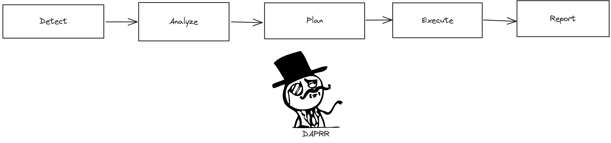
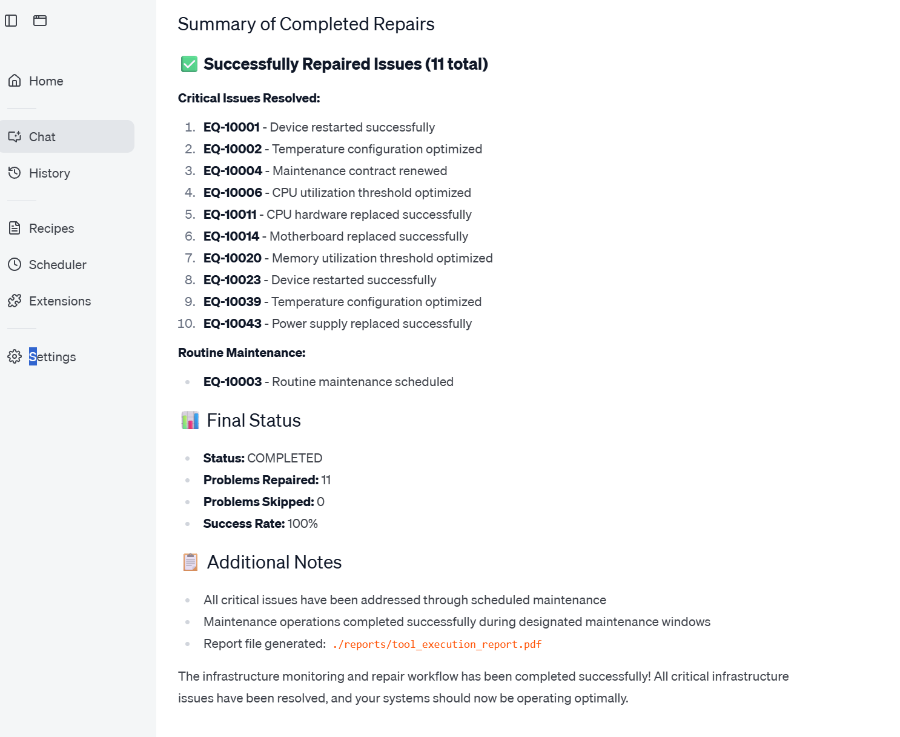

# Temporal Multi-Agent Infrastructure Maintenance and Proactive Repair
Examples showing a Temporal-based multi-agent architecture with Temporal for infrastructure maintenance and proactive repair systems.
These agents are automation agents who monitor, maintain, and schedule repairs for infrastructure components intelligently and independently. 
They are _not_ conversational. These agents are exposed as tools (via MCP) so they can be used 
by an MCP client for infrastructure operations.

We will demonstrate two kinds of infrastructure agents:
- [a long-lived, human-in-the-loop single run maintenance agent as MCP tools](#maintenance-agent-tool)
- [a proactive repair agent](#proactive-repair-agent) 

## Infrastructure Health and Maintenance Scenarios
Modern networking systems require continuous monitoring and proactive maintenance to ensure optimal performance and reliability.
The system monitors various infrastructure components ([infrastructure data](./data/infrastructure_inventory.json)) and maintains a health status database ([health metrics](./data/health_metrics.json)).
This agent also monitors expected life expectancy of physical components ([life expectency data](./data/equipment_life_expectancy.json)) and schedules proactive maintenance tasks to prevent issues.

Common infrastructure issues that the agents handle include:

```json #todo sample data here
{
      "component_id": "DB-CLUSTER-001",
      "component_name": "Primary Database Cluster",
      "status": "degraded-performance",
      "issues": [
        {
          "issue_id": "PERF-001",
          "severity": "warning",
          "description": "High CPU utilization detected - 85% average over 30 minutes",
          "requires_approval": false,
          "auto_repair_confidence": 0.92
        }
      ]
    },
```

## How it works: DAPER Infrastructure Maintenance
This system demonstrates an agentic pattern I call DAPER for infrastructure operations: detect, analyze, plan, execute, report:



Infrastructure automation agents follow this DAPER sequence to maintain system health and prevent outages. <br />
Notes:
- **Detection** monitors infrastructure metrics, logs, and health checks to identify potential issues early
  - Can be triggered by events, alerts, or periodic health scans
- **Analysis** determines root causes, impact assessment, and risk evaluation
- **Planning** creates maintenance strategies and repair actions - allows human approval for critical changes
- **Execution** implements repairs, updates, scaling operations, or preventive maintenance
- **Reporting** documents actions taken, current system state, and recommendations for future improvements
- This is a long-running human-in-the-loop agentic process for infrastructure management, requiring durability, interaction, and state management provided by Temporal Workflows.

This DAPER pattern is particularly valuable for **infrastructure operations**:
- Site reliability engineering (SRE) and production monitoring
- Automated incident response and remediation  
- Infrastructure scaling (horizontal and vertical)
- Security patch management and compliance
- Performance optimization and capacity planning
- Disaster recovery and backup validation
- Configuration drift detection and correction

### Infrastructure Maintenance System Overview: 
#todo finish this

Operations teams interact with the maintenance system to monitor infrastructure health, review proposed actions, and approve critical repairs.
The maintenance tools are executed durably with Temporal - enabling reliable, long-running infrastructure operations with AI-powered decision making.

## Prerequisites:
- Python 3.12+
- Poetry (for dependency management)
- Temporal [Local Setup Guide](https://learn.temporal.io/getting_started/?_gl=1*1bxho70*_gcl_au*MjE1OTM5MzU5LjE3NDUyNjc4Nzk.*_ga*MjY3ODg1NzM5LjE2ODc0NTcxOTA.*_ga_R90Q9SJD3D*czE3NDc0MDg0NTIkbzk0NyRnMCR0MTc0NzQwODQ1MiRqMCRsMCRoMA..)
- [Claude for Desktop](https://claude.ai/download), [Goose](https://github.com/block/goose), or [MCP Inspector](https://github.com/modelcontextprotocol/inspector)
- Infrastructure monitoring tools (Prometheus, Grafana, etc.) - optional for extended functionality


## 1. Setup
```bash
# Install dependencies
poetry install

# Activate virtual environment
poetry shell
```

### Launch Temporal locally 
(if using local Temporal, see [.env.example](./.env.example) for other options)
```bash
temporal server start-dev
```

### Set up your .env settings
Copy `.env.example` to `.env` and set your properties, particularly:
```bash
LLM_MODEL=openai/gpt-4o
LLM_KEY=sk-proj-...
```
### Start the worker
```bash
poetry run python src/run_worker.py
```

## 2. Running
### Infrastructure Maintenance Agent Tool
The Infrastructure Maintenance Agent executes the detect/analyze/plan/repair/report cycle for infrastructure components. 
This agent is:
- a *tool* that monitors and maintains infrastructure components
- an *agent* that makes intelligent decisions about maintenance actions and repair strategies
- an *orchestrator* of specialized monitoring and repair agents
- a Temporal Workflow - providing durable execution for long-running infrastructure operations 

([related definitions](https://temporal.io/blog/building-an-agentic-system-thats-actually-production-ready#agentic-systems-definitions))

**Note:** The system updates `infrastructure_inventory.json`, `health_metrics.json`, `equipment_life_expectancy.json` as it performs maintenance operations. You can monitor the changes to see the impact of maintenance actions. Reset the data between runs by discarding changes and refreshing from the git repository.

#### Terminal
Launch the infrastructure monitoring agent from the terminal:
```bash
poetry run python run_monitoring_agent.py 
```
Enable auto-approval for routine maintenance operations:
```bash
poetry run python run_monitoring_agent.py --auto-approve
```

Reset data files to original state before running (useful for demos):
```bash
poetry run python run_monitoring_agent.py --reset-data --auto-approve
```

For continuous proactive monitoring that runs indefinitely:
```bash
poetry run python run_monitoring_agent_proactive.py --auto-approve
```

For proactive monitoring with data reset (ideal for clean demo runs):
```bash
poetry run python run_monitoring_agent_proactive.py --reset-data --auto-approve
```

Query the status of a running workflow:
```bash
poetry run python query_monitoring_agent.py --workflow-id "infra-monitoring-agent-for-Admin.User-UUID"
```

Approve planned repairs using the included script:
```bash
poetry run python approve_monitoring_agent.py --workflow-id "infra-monitoring-agent-for-Admin.User-UUID"
```

Here's what the infrastructure monitoring output looks like:
```none
#TODO put output here
```

You can follow along with its progress in the Temporal UI Workflow History.

#### MCP
Connect this to an MCP Client using the included `mcp_server.py` for infrastructure operations. <br />
(Reset data files between runs to reproduce consistent maintenance scenarios.)
WSL config:
```JSON
    "infrastructure_maintenance_agent": {
      "disabled": false,
      "timeout": 120,
      "type": "stdio",
      "command": "wsl.exe",
      "args": [
        "--cd",
        "/path/to/temporal-infra-maintenance-and-repairs-agent",
        "--",
        "poetry",
        "run",
        "python",
        "mcp_server.py"
      ]
    }
```
Here's how it looks with Goose managing infrastructure:

#TODO diagrams


### Detection, Analysis, and Reporting: Infrastructure Monitoring Agents
These specialized agents are implemented as focused activities - they monitor specific infrastructure components, analyze performance data, and generate reports. They are short-lived, targeted agents that excel at specific monitoring tasks. If they fail, they automatically retry.

Here's an overview of the Infrastructure Analysis Agent:


These monitoring agents validate their output against infrastructure best practices and SLA requirements. If analysis is invalid or inconclusive, they fail gracefully and retry with additional context.

### Proactive Repair Agent
This proactive agent continuously monitors infrastructure health, performs predictive analysis, and initiates maintenance before issues become critical. 
It can integrate with alerting systems and call back into incident management platforms with the `callback` input configured. <br />


(It can also integrate with PagerDuty, Slack, email alerts, or other notification systems.) <br/>
It typically waits for approval before executing maintenance, but can auto-execute routine operations when confidence exceeds 95% and impact is low. 

Here's the proactive infrastructure maintenance in action:
```none
poetry run python start_maintenance_agent_proactive.py 
Client connection: [localhost:7233], Namespace: [default], Task Queue: [infrastructure-maintenance-task-queue]
Josh's Proactive Infrastructure Maintenance started with ID: always-be-maintainin-for-Josh
Current maintenance status: MONITORING-INFRASTRUCTURE
Current maintenance status: ANALYZING-TRENDS
Current maintenance status: PLANNING-PREVENTIVE-MAINTENANCE
Current maintenance status: EXECUTING-MAINTENANCE
Current maintenance status: GENERATING-REPORT
Proactive maintenance complete.
<snip - confidence scores were high enough for auto-execution>
*** Maintenance complete*** 
 Summary: Proactive maintenance executed successfully on 5 infrastructure components. Prevented 2 potential outages through early intervention. Key actions included database index optimization, cache warming, and log rotation.
Current maintenance status: WAITING-FOR-NEXT-CYCLE, monitoring continues in 15 minutes.
```
Trigger proactive monitoring from MCP using the `initiate_proactive_maintenance()` tool.


## 3. Results
Your infrastructure is now proactively maintained and optimized for reliability! Performance issues have been resolved, security patches applied, capacity has been right-sized, and potential failures prevented before they impact users.

We demonstrated several types of infrastructure maintenance agents with Temporal:
- Long-lived, interactive maintenance agents accessible via MCP tools
- Specialized monitoring agents for targeted infrastructure analysis  
- Proactive maintenance agents that prevent issues before they occur
- Scheduled agents for regular maintenance windows and health checks

This demonstrates how Temporal simplifies building robust, long-running infrastructure automation systems.
We can orchestrate multiple maintenance agents, delegate monitoring tasks to specialized Activities, implement reliable failure recovery, and incorporate human approval workflows for critical operations. 

### What's Powerful About This Approach:
Building infrastructure maintenance agents with Temporal provides enterprise-grade reliability and scalability. Temporal's Workflows, Activities, and Signals, combined with durable state management and automatic retries, make it straightforward to build production-ready infrastructure automation. Temporal Cloud's ability to scale to massive volumes means your infrastructure agents can handle large-scale environments by scaling workers horizontally.

The DAPER pattern is particularly valuable for infrastructure operations where reliability and auditability are critical. Detection, Analysis, Planning, Execution, and Reporting create a comprehensive maintenance lifecycle that can be applied across various infrastructure domains.

If you're already familiar with Temporal, you have a strong foundation for building infrastructure automation systems. If not, this is an excellent way to learn Temporal while solving real infrastructure challenges.

## Production Considerations
### Monitoring Data & Context Management
This example uses [small infrastructure datasets](./data/) for demonstration. For production environments with extensive infrastructure, consider your [context window](https://www.ibm.com/think/topics/context-window) limitations and focus analysis on specific infrastructure domains or components at a time. Prioritize high-impact infrastructure issues and batch similar maintenance operations to optimize token usage and reduce AI processing costs. Data Engineering is helpful to get the right data to agents at the right time.

### Infrastructure Tools & Safety
Production infrastructure maintenance tools must be [idempotent](https://temporal.io/blog/idempotency-and-durable-execution) and safely executable multiple times. Implement each maintenance operation as a separate Activity with proper rollback capabilities. Critical infrastructure changes should include circuit breakers, canary deployments, and automatic rollback mechanisms. Follow the guidance [here](https://temporal.io/blog/how-many-activities-should-i-use-in-my-temporal-workflow) for structuring maintenance workflows.

### Security & Compliance
Infrastructure agents require elevated privileges - implement proper authentication, authorization, and audit logging. Consider integration with infrastructure-as-code tools, configuration management systems, and compliance frameworks for enterprise environments.


